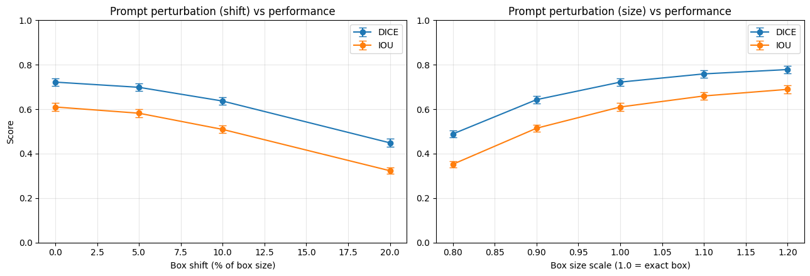
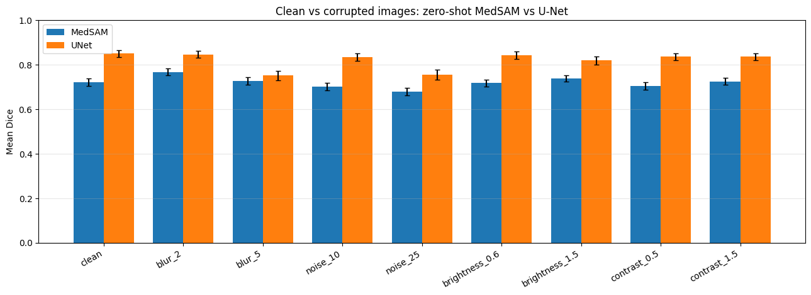
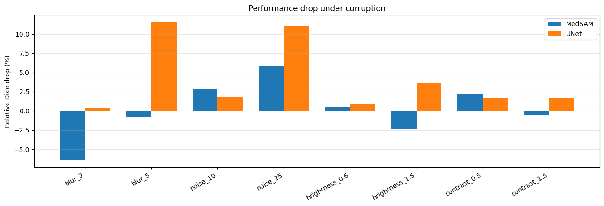
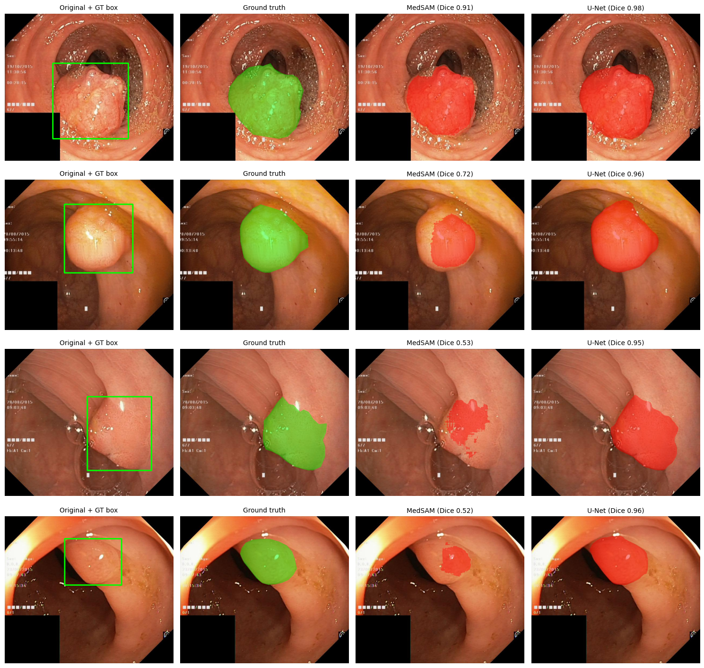
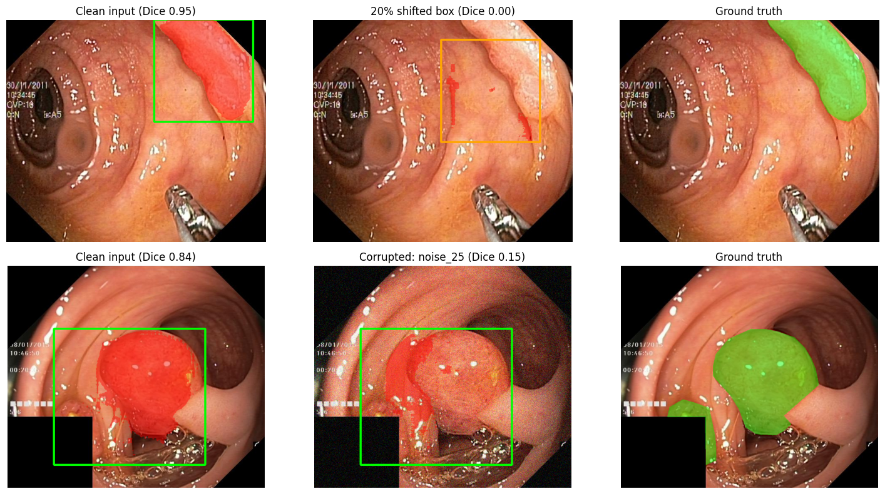

# MedSAM Robustness on Kvasir-SEG

**How robust is a zero-shot medical foundation model (MedSAM) to imperfect bounding-box prompts and degraded endoscopy images, compared with a supervised U-Net?**

This repository contains a reproducible robustness study of [MedSAM](https://github.com/bowang-lab/MedSAM) for polyp segmentation on the [Kvasir-SEG](https://datasets.simula.no/kvasir-seg/) dataset. Two kinds of perturbations are evaluated:

1. **Prompt perturbation**: the bounding-box prompt is shifted or resized, simulating an imprecise human or detector-generated box.
2. **Image corruption**: blur, Gaussian noise, brightness and contrast changes are applied to the input image, simulating real-world acquisition problems.

A supervised **U-Net (ResNet-18)** trained on the same data is used as an in-domain baseline for the image-corruption experiments.

---

## Highlights

- MedSAM is **very sensitive to box quality**: a 20% box shift cuts Dice from 0.722 to 0.449 (**-37.9%**), and shrinking the box to 80% cuts it to 0.489 (**-32.3%**).
- Making the box **larger** does not hurt; it actually helps (scale 1.2 -> Dice 0.778). Boxes that are too tight are the dangerous case.
- MedSAM is **fairly stable to image corruption** (max relative drop ~6%, from heavy noise), while the U-Net loses about 11% under strong blur and strong noise.
- The supervised U-Net has **higher absolute Dice** than zero-shot MedSAM in every corruption condition, but it is trained in-domain while MedSAM is zero-shot, so the gap should be read with the caveats below.

---

## Experimental setup

| Item | Details |
|---|---|
| Dataset | Kvasir-SEG, 1000 polyp images with masks (loaded from Hugging Face, `MedOtter/KvasirSEG`) |
| Split | 80/20 random split (800 train / 200 test), seed 42 |
| MedSAM | `wanglab/medsam-vit-base` (Hugging Face `transformers`), **zero-shot**, single box prompt, single-mask output |
| Prompt | Tight box derived from the ground-truth mask (the "clean" condition) |
| U-Net baseline | `segmentation_models_pytorch` U-Net, ResNet-18 encoder (ImageNet weights), 256x256 input, 15 epochs, Adam (lr 3e-4), batch size 16, Dice + BCE loss, random flips. **No corruption augmentation.** |
| Metrics | Dice and IoU per image, averaged over the 200 test images |

### Prompt perturbations (MedSAM only)

| Type | Levels | Description |
|---|---|---|
| Shift | 5%, 10%, 20% | Box moved diagonally by a fraction of its width/height. The direction is random but fixed per image, so all levels share the same direction. |
| Scale | 0.8, 0.9, 1.1, 1.2 | Box resized around its centre. |

### Image corruptions (MedSAM and U-Net)

| Corruption | Mild | Severe |
|---|---|---|
| Gaussian blur (sigma, scaled to image size) | 2 | 5 |
| Gaussian noise (std, 0-255 scale) | 10 | 25 |
| Brightness (multiplicative factor) | 0.6 | 1.5 |
| Contrast (factor around image mean) | 0.5 | 1.5 |

For corruption experiments, MedSAM still receives the **clean** ground-truth box, so only the image changes.

---

## Results

### 1. Prompt perturbation (MedSAM)

Clean Dice: **0.7218** | Clean IoU: **0.6100**

| Condition | Mean Dice | Mean IoU | Abs. drop (Dice) | Rel. drop (Dice) |
|---|---|---|---|---|
| shift 5% | 0.6985 | 0.5820 | 0.0234 | 3.24% |
| shift 10% | 0.6367 | 0.5091 | 0.0852 | 11.80% |
| shift 20% | 0.4486 | 0.3231 | 0.2733 | 37.86% |
| scale 0.8 | 0.4887 | 0.3523 | 0.2331 | 32.29% |
| scale 0.9 | 0.6429 | 0.5144 | 0.0789 | 10.93% |
| scale 1.1 | 0.7589 | 0.6597 | -0.0370 | -5.13% |
| scale 1.2 | 0.7784 | 0.6893 | -0.0565 | -7.83% |

*(A negative drop means performance improved relative to the clean box.)*



**Takeaways**

- Degradation is **non-linear**: 5% shift costs ~3%, 10% costs ~12%, 20% costs ~38%.
- The model is **asymmetric** to box size: boxes that are too small (0.8x) are far worse than boxes that are too large (1.2x). A tight box can cut off parts of the polyp, and the model then segments only a sub-region.

### 2. Image corruption (MedSAM vs. U-Net)

| Condition | MedSAM Dice | MedSAM rel. drop | U-Net Dice | U-Net rel. drop |
|---|---|---|---|---|
| clean | 0.7218 | - | 0.8503 | - |
| blur (sigma 2) | 0.7682 | -6.41% | 0.8471 | 0.38% |
| blur (sigma 5) | 0.7276 | -0.80% | 0.7520 | 11.56% |
| noise (std 10) | 0.7017 | 2.80% | 0.8355 | 1.74% |
| noise (std 25) | 0.6791 | 5.92% | 0.7565 | 11.04% |
| brightness 0.6 | 0.7177 | 0.57% | 0.8427 | 0.90% |
| brightness 1.5 | 0.7384 | -2.30% | 0.8192 | 3.66% |
| contrast 0.5 | 0.7056 | 2.25% | 0.8363 | 1.65% |
| contrast 1.5 | 0.7257 | -0.53% | 0.8365 | 1.63% |





**Takeaways**

- **Gaussian noise (std 25)** is the most damaging corruption for MedSAM (-5.9% relative Dice).
- The U-Net degrades much more under **strong blur and strong noise** (about -11% each), while MedSAM stays within a few percent.
- Mild blur slightly *improves* MedSAM's Dice. A plausible explanation is that smoothing removes specular highlights and fine texture, but this was not tested here.

### 3. Qualitative results

Original image with the ground-truth box, ground truth, MedSAM prediction and U-Net prediction (Dice shown in each title).



MedSAM often recovers only the central part of a polyp, producing under-segmented, fragmented masks. The U-Net, having been trained on this exact data distribution, produces smoother and more complete masks.

### 4. Most difficult cases

Top row: the image where a 20% box shift hurt MedSAM the most. Bottom row: the image where the most damaging corruption (noise, std 25) hurt MedSAM the most.



---

## Discussion and caveats

- **This is not a like-for-like comparison.** MedSAM is evaluated **zero-shot** with a box prompt (privileged information from the ground-truth mask), while the U-Net is **trained on 800 in-domain images**. The U-Net's higher clean Dice (0.850 vs 0.722) should not be read as "U-Net is better than MedSAM" in general.
- **MedSAM's clean Dice is lower than typically reported.** The fact that larger boxes (1.1x, 1.2x) score *higher* than the exact tight box suggests the tight-box setting is not optimal for this checkpoint and preprocessing pipeline (the Hugging Face `SamProcessor` from `facebook/sam-vit-base` is used for pre/post-processing). Matching the original MedSAM preprocessing exactly could change absolute numbers.
- **Single run.** One random split, one seed, one U-Net training run. Error bars in Figure 1 and 2 are standard errors over test images only and do not capture variance across seeds or splits.
- **The U-Net was not trained with corruption augmentation.** Its sensitivity to blur and noise is therefore expected; a fairer robustness comparison would also include an augmented baseline.
- Corruptions are synthetic and applied one at a time. Real endoscopy artefacts (bubbles, specular reflections, motion blur, bleeding) are more complex.

## Reproducing the results

```bash
git clone https://github.com/<your-username>/medsam-kvasir-robustness.git
cd medsam-kvasir-robustness
pip install -r requirements.txt
jupyter notebook notebooks/MedSAM_Kvasir_Robustness.ipynb
```

The notebook was run on Google Colab with a Tesla T4 GPU. It downloads the dataset and the model weights automatically, runs all experiments, and writes figures and CSV files (`all_results.csv`, `drop_tables.csv`, `summary_mean_std.csv`). Change the `figures/` save paths in the plotting cells to `results/` if you want them to land in this folder directly.

## Repository structure

```
medsam-kvasir-robustness/
├── notebooks/
│   └── MedSAM_Kvasir_Robustness.ipynb   # full pipeline: data, MedSAM, U-Net, evaluation, plots
├── results/
│   ├── fig1_prompt_robustness.png
│   ├── fig2_corruption_comparison.png
│   ├── fig3_relative_drop.png
│   ├── fig4_qualitative.png
│   ├── fig5_difficult_cases.png
│   └── mean_scores.csv                  # mean Dice / IoU per model and condition
├── requirements.txt
├── .gitignore
└── README.md
```

## References

- Ma, J. et al. *Segment Anything in Medical Images (MedSAM).* Nature Communications, 2024.
- Kirillov, A. et al. *Segment Anything.* ICCV, 2023.
- Jha, D. et al. *Kvasir-SEG: A Segmented Polyp Dataset.* MMM, 2020.
- Ronneberger, O. et al. *U-Net: Convolutional Networks for Biomedical Image Segmentation.* MICCAI, 2015.
